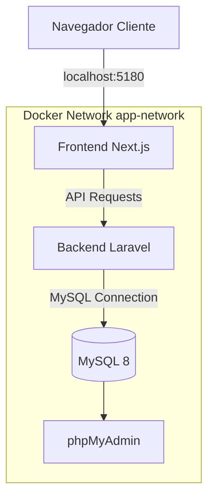

# Simulación de despliegue (LOCAL)

1. Clonar proyecto “VERTISOL-yaml” en una carpeta predefinida “app-mensajes” con comando `git clone https://github.com/IngLucioChavez/VERTISOL-yaml.git app-fintech`
2. Acceder a la carpeta generada “app-fintech”
3. Clonar proyecto “VERTISOL-front-end” con comando `git clone https://github.com/IngLucioChavez/VERTISOL-front-end.git front-end`
4. Clonar Proyecto “VERTISOL-back-end” con comando `git clone https://github.com/IngLucioChavez/VERTISOL-back-end.git back-end`
6. Ejecutar comando `docker compose build –no-cache` para construcción de images
7. Ejecutar comando `docker compose up -d` para levantar contenedores en puertos configurados
8. Se observan los contenedores levantados y accesibles.
9. Acceder a contenedor *LARAVEL-API-VERTISOL* con comando `docker container exec -it LARAVEL-API-VERTISOL bash`
11. Generar el archivo .env con las variables indicadas

```
APP_NAME=Laravel
APP_ENV=local
APP_KEY=base64:RjKfCkoc5MqQB4wSOIK5hT5hx5tdSOHoyGnI2C+1Nu4=
APP_DEBUG=true
APP_URL=http://localhost

APP_LOCALE=en
APP_FALLBACK_LOCALE=en
APP_FAKER_LOCALE=en_US

APP_MAINTENANCE_DRIVER=file

BCRYPT_ROUNDS=12

LOG_CHANNEL=stack
LOG_STACK=single
LOG_DEPRECATIONS_CHANNEL=null
LOG_LEVEL=debug

DB_CONNECTION=mysql
DB_HOST=MYSQL-VERTISOL
DB_PORT=3306
DB_DATABASE=vertisol_DB
DB_USERNAME=root
DB_PASSWORD=root123

SESSION_DRIVER=file
SESSION_LIFETIME=120
SESSION_ENCRYPT=false
SESSION_PATH=/
SESSION_DOMAIN=null

BROADCAST_CONNECTION=log
FILESYSTEM_DISK=local
QUEUE_CONNECTION=sync

CACHE_STORE=file

MEMCACHED_HOST=127.0.0.1

REDIS_CLIENT=phpredis
REDIS_HOST=127.0.0.1
REDIS_PASSWORD=null
REDIS_PORT=6379

MAIL_MAILER=log
MAIL_SCHEME=null
MAIL_HOST=127.0.0.1
MAIL_PORT=2525
MAIL_USERNAME=null
MAIL_PASSWORD=null
MAIL_FROM_ADDRESS="hello@example.com"
MAIL_FROM_NAME="${APP_NAME}"

AWS_ACCESS_KEY_ID=
AWS_SECRET_ACCESS_KEY=
AWS_DEFAULT_REGION=us-east-1
AWS_BUCKET=
AWS_USE_PATH_STYLE_ENDPOINT=false

VITE_APP_NAME="${APP_NAME}"

JWT_SECRET=
```
11. En consola ejecutar comando `php artisan migrate` para ejecutar migraciones y `php artisan jwt:secret` para generar llave de validación JWT

# Arquitectura de Contenedores — Proyecto VERTISOL

## Descripción General

La arquitectura del proyecto está basada en contenedores Docker utilizando **Docker Compose** para la orquestación de servicios.

El sistema se compone de:

* Frontend en **Next.js + TypeScript**
* Backend en **Laravel + PHP**
* Base de datos **MySQL 8**
* Administrador visual **phpMyAdmin**

Todos los servicios se comunican mediante una red privada Docker llamada `app-network`.

---

# Diagrama General de Arquitectura



---

# Servicios

## 1. Frontend — Next.js + TypeScript

### Contenedor

`NEXT-TS-VERTISOL`

### Tecnologías

* Next.js
* React
* TypeScript
* Node.js

### Configuración

| Propiedad         | Valor                      |
| ----------------- | -------------------------- |
| Puerto host       | `5180`                     |
| Puerto contenedor | `3000`                     |
| Volumen principal | `./front-end:/var/www/app` |

### Objetivo

Proporcionar la interfaz web principal del sistema VERTISOL.

### Características

* Hot Reload habilitado mediante volúmenes Docker.
* Comunicación directa con la API Laravel.
* Persistencia de `node_modules`.
* Ejecución aislada mediante contenedor Docker.

### Acceso

```bash
http://localhost:5180
```

---

## 2. Backend — Laravel API

### Contenedor

`LARAVEL-API-VERTISOL`

### Tecnologías

* Laravel
* PHP
* Composer

### Configuración

| Propiedad             | Valor           |
| --------------------- | --------------- |
| Puerto host           | `8000`          |
| Puerto contenedor     | `8000`          |
| Directorio de trabajo | `/var/www/html` |

### Comando de ejecución

```bash
php artisan serve --host=0.0.0.0 --port=8000
```

### Variables de entorno

| Variable      | Valor       |
| ------------- | ----------- |
| DB_CONNECTION | mysql       |
| DB_HOST       | mysql       |
| DB_PORT       | 3306        |
| DB_DATABASE   | vertisol_DB |
| DB_USERNAME   | root        |
| DB_PASSWORD   | root123     |

### Objetivo

Gestionar:

* Lógica de negocio
* API REST
* Autenticación
* Persistencia de datos
* Integración con MySQL

### Acceso

```bash
http://localhost:8000
```

---

## 3. Base de Datos — MySQL 8

### Contenedor

`MYSQL-VERTISOL`

### Tecnología

* MySQL 8.0

### Configuración

| Propiedad         | Valor  |
| ----------------- | ------ |
| Puerto host       | `3306` |
| Puerto contenedor | `3306` |

### Variables de entorno

| Variable            | Valor       |
| ------------------- | ----------- |
| MYSQL_DATABASE      | vertisol_DB |
| MYSQL_USER          | app_user    |
| MYSQL_PASSWORD      | secret123   |
| MYSQL_ROOT_PASSWORD | root123     |

### Persistencia

```yaml
volumes:
  - mysql_data-app-vertisol:/var/lib/mysql
```

### Objetivo

Almacenar toda la información persistente del sistema.

---

## 4. phpMyAdmin

### Contenedor

`phpmyadmin`

### Tecnología

* phpMyAdmin

### Configuración

| Propiedad         | Valor  |
| ----------------- | ------ |
| Puerto host       | `8080` |
| Puerto contenedor | `80`   |

### Variables de entorno

| Variable | Valor |
| -------- | ----- |
| PMA_HOST | mysql |
| PMA_PORT | 3306  |

### Objetivo

Administrar visualmente la base de datos MySQL.

### Acceso

```bash
http://localhost:8080
```

---

# Red Docker

## Nombre de la red

```yaml
app-network
```

## Driver

```yaml
bridge
```

## Objetivo

Permitir la comunicación interna entre:

* Frontend
* Backend
* MySQL
* phpMyAdmin

---

# Volúmenes Docker

## Volumen Persistente

```yaml
mysql_data-app-vertisol
```

## Objetivo

Mantener persistentes los datos de MySQL incluso después de reiniciar o eliminar los contenedores.

---

# Flujo de Comunicación

```text
Usuario
   │
   ▼
Frontend (Next.js)
   │
   ▼
Backend Laravel API
   │
   ▼
MySQL Database
```

---

# Dependencias entre Servicios

| Servicio   | Depende de |
| ---------- | ---------- |
| frontend   | backend    |
| backend    | mysql      |
| phpmyadmin | mysql      |

---

# Puertos del Proyecto

| Servicio         | Puerto Host | Puerto Contenedor |
| ---------------- | ----------- | ----------------- |
| Frontend Next.js | 5180        | 3000              |
| Backend Laravel  | 8000        | 8000              |
| MySQL            | 3306        | 3306              |
| phpMyAdmin       | 8080        | 80                |

---

# Comandos Útiles

## Levantar contenedores

```bash
docker compose up -d
```

## Detener contenedores

```bash
docker compose down
```

## Ver logs

```bash
docker compose logs -f
```

## Acceder al contenedor Laravel

```bash
docker exec -it LARAVEL-API-VERTISOL bash
```

## Ejecutar migraciones

```bash
php artisan migrate
```

## Generar APP_KEY

```bash
php artisan key:generate
```

---

# Beneficios de la Arquitectura

* Separación clara de responsabilidades.
* Entorno reproducible entre desarrolladores.
* Fácil despliegue en distintos ambientes.
* Persistencia de datos mediante Docker Volumes.
* Comunicación aislada mediante red privada Docker.
* Escalabilidad de servicios.
* Hot Reload durante desarrollo.
* Administración visual de base de datos.

---

# Estructura Recomendada del Proyecto

```text
project-root/
│
├── docker-compose.yml
│
├── front-end/
│   ├── Dockerfile
│   └── ...
│
├── back-end/
│   ├── Dockerfile
│   └── ...
│
└── README.md
```


